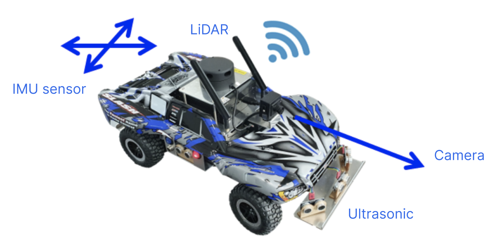

# Autonomous Driving Competition
Competition Task: A RC car has to do 3 long loops of high speed driving to keep the lane and a loop of various missions completion in a row without human intervention.

There are many code files that make up this project, but only the code below will be open.

### Competition Track

  

### Hardware
The RC car is named Xycar X model, a high speed racing robot powered by NVIDIA AGX Xavier.

  

## High Speed Driving

### Driver Behavioral Cloning
We developed a driver behavioural cloning model using CNN and LSTM for end-to-end self-driving in a simulated environment. 
  

### Lane Detection
We developed a lane detection algorithm with OpenCV-Python.  
  

## Mission Driving

